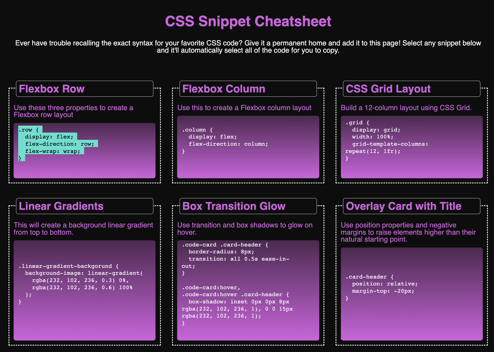

  [Visit the Deployed Site](https://kfmatovic716.github.io/css-snippet-cheatsheet/)

## Description

A summary of CSS code snippets that helps students in their learning journey to become web developers. 

## Contributors

### [David Wright](https://github.com/d-a-v-i-d-w-r-i-g-h-t/)
